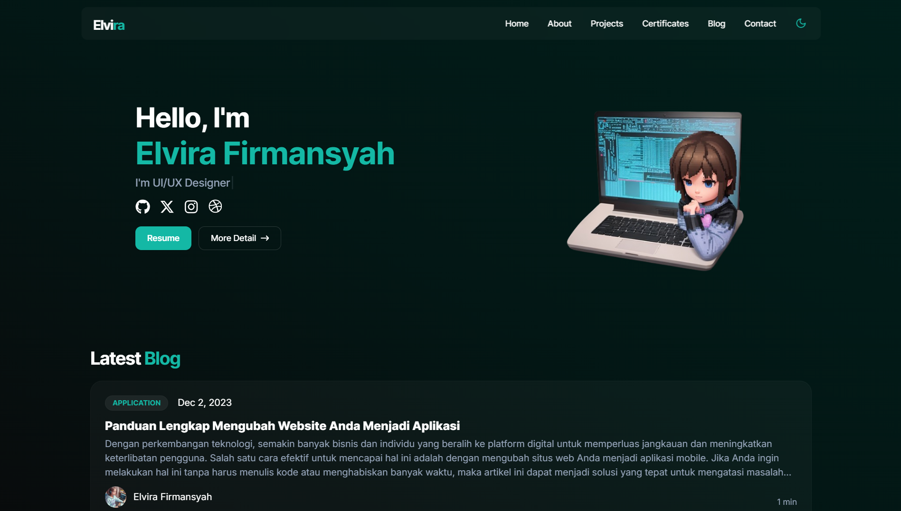

<div id="top"></div>

<!-- PROJECT LOGO -->
<div align="center">
  <a href="https://github.com/othneildrew/Best-README-Template">
    
  </a>

  <h3 align="center">elvira.vercel.app</h3>

  <p align="center">
    Web Developer & UI/UX Designer
    <br />
    <br />
    <a href="https://elvira.vercel.app" target="_blank">View Demo</a>
    ·
    <a href="https://github.com/elvirafimansyah/portofolio-v3/issues">Report Bug</a>
    ·
    <a href="https://github.com/elvirafimansyah/portofolio-v3/issues">Request Feature</a>
  </p>
</div>

<!-- ABOUT THE PROJECT -->


### Built With

* [Next.js](https://nextjs.org/)
* [Shadcn UI](https://ui.shadcn.com/)
* [Tailwind CSS](https://tailwindcss.com/)
* [Font Awesome](https://fontawesome.com/)
* [React Icons](https://react-icons.github.io/react-icons/)
* [Vercel](https://vercel.com/)


### Running Locally
1. Clone the repo
   ```sh
   git clone https://github.com/elvirafimansyah/portofolio-v3.git
   ```
3. Install NPM packages
   ```sh
   npm install
   ```
2. ```sh
   npm run dev
   ```
3. Navigate to http://localhost:3000.


<!-- LICENSE -->
## License

Distributed under the MIT License. See [MIT LICENSE](LICENSE) for more information.


<!-- CONTACT -->
## Contact

Elvira Firmansyah - [@virn_el](https://instagram.com/virn_el) - elvirafirmansyah@gmail.com

Portofolio: [Elvira Firmansyah](https://elvira.vercel.app)

<p align="right"><a href="#top">🔝</a></p>

